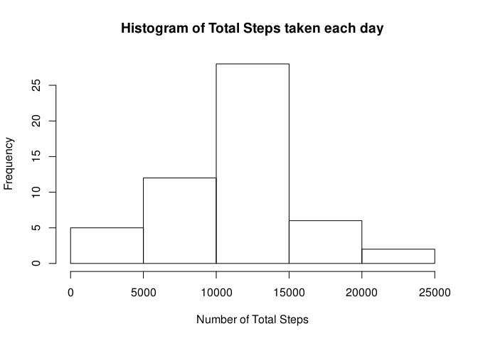
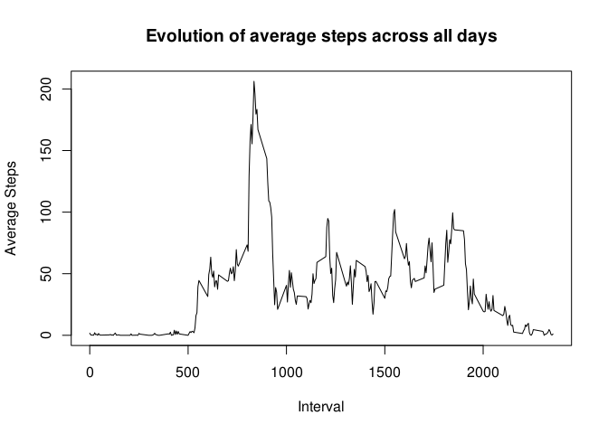
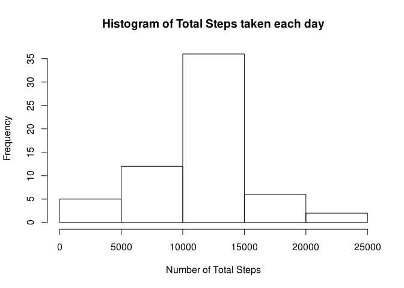
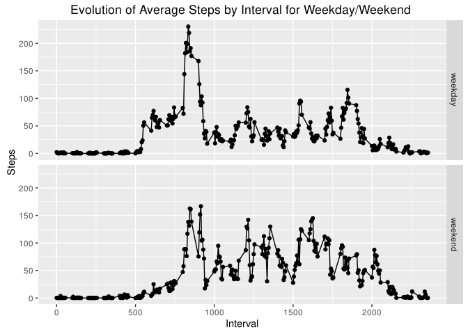

# Reproducible Research: Peer Assessment 1


## Loading and preprocessing the data
1. Load the data (i.e. read.csv())

```r
unzip("activity.zip")
activity <- read.csv("activity.csv")
```

2. Process/transform the data (if necessary) into a format suitable for your analysis

```r
clean_activity <- subset(activity, steps != 'NA')
```


## What is mean total number of steps taken per day?
1. Calculate the total number of steps taken per day

```r
by_date <- aggregate(steps ~ date, data=clean_activity, FUN=sum)
head(by_date)
```

```
##         date steps
## 1 2012-10-02   126
## 2 2012-10-03 11352
## 3 2012-10-04 12116
## 4 2012-10-05 13294
## 5 2012-10-06 15420
## 6 2012-10-07 11015
```

2. Make a histogram of the total number of steps taken each day (ie. NOT THE BARPLOT WITH STEPS PER DAY)

```r
with(by_date, hist(steps, main="Histogram of Total Steps taken each day", xlab="Number of Total Steps"))
```

<!-- -->

3. Calculate and report the mean and median of the total number of steps taken per day

```r
mean(by_date$steps)
```

```
## [1] 10766.19
```

```r
median(by_date$steps)
```

```
## [1] 10765
```


## What is the average daily activity pattern?

1. Make a time series plot (i.e. type = "l") of the 5-minute interval (x-axis) and the average number of steps taken, averaged across all days (y-axis)

```r
avg_steps_interval <- aggregate(steps ~ interval, data=clean_activity, FUN=mean)
plot(avg_steps_interval, type="l", xlab="Interval", ylab="Average Steps", main="Evolution of average steps across all days")
```

<!-- -->

2. Which 5-minute interval, on average across all the days in the dataset, contains the maximum number of steps?

```r
max_avg_steps <- max(avg_steps_interval$steps)
subset(avg_steps_interval, steps == max_avg_steps)$interval
```

```
## [1] 835
```


## Imputing missing values

1. Calculate and report the total number of missing values in the dataset (i.e. the total number of rows with NAs)

```r
sum(is.na(activity$steps))
```

```
## [1] 2304
```

2. Devise a strategy for filling in all of the missing values in the dataset. The strategy does not need to be sophisticated. For example, you could use the mean/median for that day, or the mean for that 5-minute interval, etc.

Checking which days have NA

```r
missing_dates <- as.Date(unique(activity$date[is.na(activity$steps)]))
weekdays(missing_dates)
```

```
## [1] "Monday"    "Monday"    "Thursday"  "Sunday"    "Friday"    "Saturday" 
## [7] "Wednesday" "Friday"
```

```r
missing_intervals <- activity$interval[is.na(activity$steps)]
length(missing_intervals)
```

```
## [1] 2304
```

```r
length(unique(missing_intervals))
```

```
## [1] 288
```
No pattern found on weekdays, 288 different time intervals, 8 days missing, accounts for all 2304  intervals on those days. The mean across all days for a missing interval will be used.

3. Create a new dataset that is equal to the original dataset but with the missing data filled in.

```r
get_interval <- function(x) { avg_steps_interval$steps[avg_steps_interval$interval == x] }
clean_activity <- activity
missing_activities<-activity[is.na(activity$steps), ]
clean_activity$steps[is.na(activity$steps)] <- sapply(missing_activities$interval, get_interval)
```


4. Make a histogram of the total number of steps taken each day and Calculate and report the mean and median total number of steps taken per day. Do these values differ from the estimates from the first part of the assignment? What is the impact of imputing missing data on the estimates of the total daily number of steps?

```r
by_date2 <- aggregate(steps ~ date, data=clean_activity, FUN=sum)
with(by_date2, hist(steps, main="Histogram of Total Steps taken each day", xlab="Number of Total Steps"))
```

<!-- -->

```r
mean(by_date2$steps)
```

```
## [1] 10766.19
```

```r
median(by_date2$steps)
```

```
## [1] 10766.19
```
As I'm using the mean value to replace the missing data, one can expect the mean value would not change, which happens to be true. Both before and after the mean value stays the same. The median however is slightly changed. If you take a closer look on the histogram of total number of steps taken each day, you can see the increase in frequency, which is explained by inputting the missing days.


## Are there differences in activity patterns between weekdays and weekends?

1. Create a new factor variable in the dataset with two levels – “weekday” and “weekend” indicating whether a given date is a weekday or weekend day.

```r
get_daytype <- function(x) { if (x %in% c("Saturday", "Sunday")) { "weekend" } else { "weekday"}}
clean_activity$daytype <- as.factor(sapply(weekdays(as.Date(clean_activity$date)), get_daytype))
```

2. Make a panel plot containing a time series plot (i.e. type = "l") of the 5-minute interval (x-axis) and the average number of steps taken, averaged across all weekday days or weekend days (y-axis). See the README file in the GitHub repository to see an example of what this plot should look like using simulated data.


```r
avg_steps_interval <- aggregate(clean_activity$steps, list(interval = clean_activity$interval, daytype=clean_activity$daytype), FUN=mean)
library(ggplot2)
with(avg_steps_interval, qplot(interval, x, facets = daytype~.))+geom_line()+labs(x="Interval", y="Steps", title="Evolution of Average Steps by Interval for Weekday/Weekend ")
```

<!-- -->
